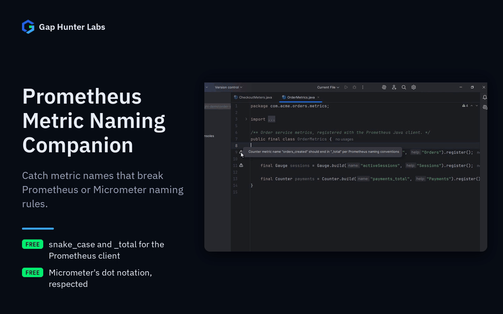

# Prometheus Metric Naming Companion

Warning icon on any Java/Kotlin metric name literal that violates
Prometheus's own documented naming conventions
(prometheus.io/docs/practices/naming) — recognizes the two most common
real registration shapes: the Prometheus Java client's
`Counter.build("name", "help")` and Micrometer's
`Counter.builder("name")` (same for Gauge/Histogram/Summary/Timer).



Each feature on its own:
[Prometheus client names](docs/media/01-prometheus-client.gif) ·
[Micrometer names](docs/media/02-micrometer.gif)

## Why it exists

A metric name typo or convention violation ships silently — nothing
fails at compile time or runtime, it just quietly produces a metric
that breaks dashboards/alerting rules built against the standard
naming convention (e.g. an alerting rule expecting `_total` suffixes
on every counter). Catching this at write time is much cheaper than
after a dashboard goes dark.

## Why built this way

- **100% static PSI analysis** — matches by simple class/method name
  only, works whether the real Prometheus/Micrometer jar is on the
  classpath or not. Java and Kotlin.
- **Only 3 real, spec-documented rules checked**, not an opinionated
  invented convention: lowercase snake_case, a counter's `_total`
  suffix, and a Histogram/Summary's name never manually carrying
  `_bucket`/`_count`/`_sum` (the client library appends those itself
  when exposing the metric — a manually-added one produces a broken/
  duplicated name at scrape time) — all three cited directly in
  Prometheus's own naming documentation.
- **Micrometer names follow Micrometer's convention, not Prometheus's.**
  Micrometer documents lowercase words separated by dots
  (`http.server.requests`), and its Prometheus registry turns them into
  snake_case and leaves `_total` to the Prometheus client, which adds
  it itself. So `Counter.builder("orders.created")` is fine; only an
  uppercase/camelCase Micrometer name (and a manual
  `_bucket`/`_count`/`_sum`) is reported.

## v0.1 scope — stated honestly, not exhaustively

Only the name literal passed directly to `build(...)`/`builder(...)` is
checked — the Prometheus client's alternate chained form
(`Counter.build().name("x")`) isn't covered yet. An interpolated
Kotlin string (`"${prefix}_requests"`) is never checked — same "exact
literal only" discipline as `feature-flag-reference-companion`.

## Usage

Open any Java/Kotlin file registering a Prometheus/Micrometer metric. A
naming violation shows a warning icon on the name literal.

## Support

- **Bugs and feature requests:** [GitHub Issues](https://github.com/GapHunterLabs/prometheus-metric-naming-companion/issues)
- **Questions, or custom rules for a team's codebase:** **gaphunterlabs@gmail.com**
- **Security vulnerabilities:** report privately as described in [SECURITY.md](SECURITY.md), not in a public issue.
- **Privacy and network behavior:** [PRIVACY.md](PRIVACY.md)

## Development

```
./gradlew test           # unit tests
./gradlew buildPlugin    # generates build/distributions/*.zip
./gradlew verifyPlugin   # checks compatibility against real IDEs
```

## License

Apache-2.0. See `LICENSE`.
